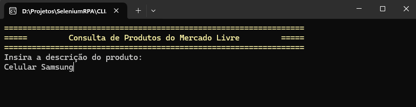
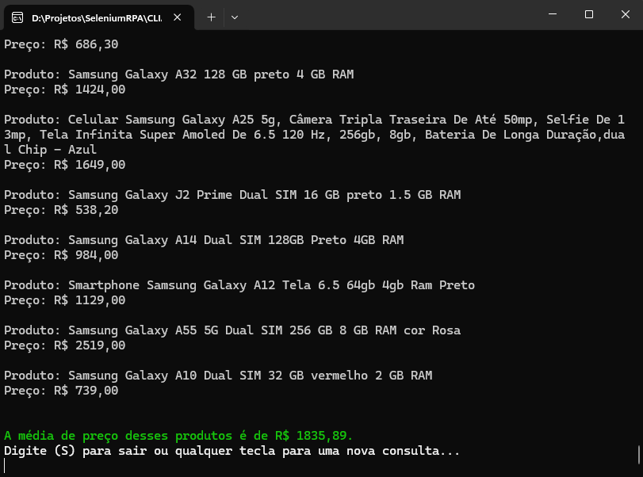

<h1 align="center">
  Selenium RPA
  
</h1>

Application to consult product information on Mercado Livre.

  
  
  
  
  

## :book: About
This is a Robotic Process Automation (RPA) using .NET and C# to get the information about products on Mercado Livre based on the product description provided.

This application outputs the description and the price of all the products found in the first page, after that, show the average price.

> Doing a product check with the product description "celulares da samsung" that means Samsung Smartphones.

> Return from data extraction, displaying product description, price and average price of all listed products.

## ⚒️ Technologies
- [C#](https://docs.microsoft.com/pt-br/dotnet/csharp/)
- [.NET 8](https://learn.microsoft.com/pt-br/dotnet/core/whats-new/dotnet-8/overview)
- [ChatGPT](https://chat.openai.com/)
- [Selenium](https://www.selenium.dev/)
- [Google Chrome](https://www.google.com/intl/pt-BR/chrome/)

## 🚀 Running the Application

- Clone this repository with `git clone https://github.com/nakagawa25/selenium-bot.git`
- Open Windows PowerShell in repository root directory
- Build the project with `dotnet build .\CLIApplication\`
- Start the application with `.\CLIApplication\bin\Debug\net8.0\CLIApplication.exe`

## 🥾 Next Steps

Project progress.

- [x] Get products from the Mercado Livre products list.
- [x] Get current prices for each product.
- [x] Calculate average price of products.
- [ ] Extract data from all product list pages.
- [ ] Identify kits and batch products for greater price accuracy.
